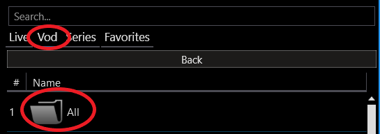

## Sfvip all
**sfvip all** wraps **sfvip player** with a proxy that inserts an "All" category into _Vod_ and _Series_.

**So you can easily browse the entire catalog**.

## Install

- You must have launched **sfvip player** at least once.
- Get the archive from [**here**](https://github.com/sebdelsol/sfvip-all/raw/master/sfvip_all.zip).
- Unzip it.
- Launch **sfvip_all.exe**.

_The archive might be removed by MS defender due to this [bug](https://github.com/pyinstaller/pyinstaller/issues/5854)._
