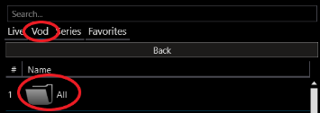

# Svfip All

**Svfip All** wraps **Sfvip Player** with a proxy that inserts an "All" category into _Vod_ and _Series_.  
**So you can easily browse the entire catalog**.

## Run

- Download it [**from here**](https://github.com/sebdelsol/sfvip-all/raw/master/build/Svfip%20All%201.1.1.zip) & unzip[^1].
- Launch **`Svfip All.exe`**[^2].

## Build

- `pip install -r requirements.txt`
- `pip install -r requirements.dev.txt`
- Check [build_config.py](https://github.com/sebdelsol/sfvip-all/blob/master/build_config.py).
- `python build.py`

[^1]: _The archive might be removed by MS defender due to this [bug](https://github.com/pyinstaller/pyinstaller/issues/5854)._
[^2]: _You must have launched **Sfvip Player** at least once before_