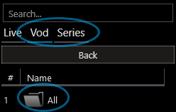
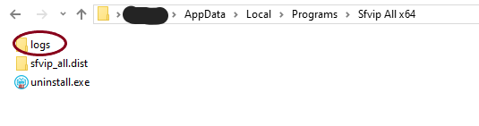

# <kbd></kbd> Sfvip All
***Sfvip All*** wraps ***[Sfvip Player](https://github.com/K4L4Uz/SFVIP-Player/tree/master)*** to add new features: 
* Insert an _All_ category when missing so you can easily **search your entire catalog**.  
* Update ***[Mpv](https://mpv.io/)*** and ***[Sfvip Player](https://github.com/K4L4Uz/SFVIP-Player/tree/master)*** so you can enjoy their latest features. 
* Support an **external EPG**[^1].

<kbd></kbd>

[^1]: External EPG doesn't work with **local** m3u accounts.
# Download
[](https://github.com/sebdelsol/sfvip-all/releases/download/Sfvip.All.1.4.12.33/Install.Sfvip.All.1.4.12.33.x64.exe)
<sup><sup>_by MS Defender • 1.1.24010.10 • 1.405.697.0_</sup></sup>

[](https://github.com/sebdelsol/sfvip-all/releases/download/Sfvip.All.1.4.12.33/Install.Sfvip.All.1.4.12.33.x86.exe)
<sup><sup>_by MS Defender • 1.1.24010.10 • 1.405.697.0_</sup></sup>

[](https://tooomm.github.io/github-release-stats/?username=sebdelsol&repository=sfvip-all)
[](https://github.com/sebdelsol/sfvip-all/issues?q=is%3Aopen)


Check the [***changelog***](build/changelog.md) and ***notes***[^2].  
[***Sfvip Player***](https://github.com/K4L4Uz/SFVIP-Player/tree/master) will be automatically installed if missing.  
Please use [***SfvipUserProxy***](user_proxy_cmd) if you need to add or remove an user proxy for ***all users*** in ***Sfvip Player*** database.

[^2]:_**Sfvip All** will ask you for network connection its first run because it relies on local proxies to do its magic._  
_On **old systems** you might need to install [**vc redist**](https://learn.microsoft.com/en-GB/cpp/windows/latest-supported-vc-redist) for [**x86**](https://aka.ms/vs/17/release/vc_redist.x86.exe) or [**x64**](https://aka.ms/vs/17/release/vc_redist.x64.exe)._  

# Logs
The logs go **in pairs**: one for the _main_ process and one for the _mitmproxy_ process.  
The logs are to be found in the app folder:

<kbd></kbd>  

# Build
[](https://www.python.org/downloads/release/python-3118/)
[](https://mitmproxy.org/)
[](https://black.readthedocs.io/en/stable/)
[](https://api.codetabs.com/v1/loc/?github=sebdelsol/sfvip-all)
[](https://nsis.sourceforge.io/Download)
[](https://nuitka.net/)
[](https://pyinstaller.org/en/stable/)

[***NSIS***](https://nsis.sourceforge.io/Download) will be automatically installed if missing.  
Check the [***build config***](build_config.py).

### Create the environments
You need [***Rust***](https://www.rust-lang.org/fr), [***Python 3.11 x64***](https://www.python.org/ftp/python/3.11.8/python-3.11.8-amd64.exe) & [***x86***](https://www.python.org/ftp/python/3.11.8/python-3.11.8.exe):
```console
rustup target add i686-pc-windows-msvc
py -3.11-64 -m dev.create
py -3.11-32 -m dev.create
```
Get a [***Github token***](https://docs.github.com/en/authentication/keeping-your-account-and-data-secure/managing-your-personal-access-tokens#personal-access-tokens-classic) and a [***DeepL API key***](https://www.deepl.com/en/docs-api/).  
Store those in `api_keys.py`:
```python3
# api_keys.py
GITHUB_TOKEN=your_github_token
DEEPL_KEY=your_deepl_api_key
```

### Activate the _x64_ environment
```console
.sfvip64\scripts\activate
```
### Run locally
```console
python -m sfvip_all
```
### Build with ***PyInstaller***
It's the _fastest option but with more AV false positives:_
```console
python -m dev.build --pyinstaller
```
### Build with ***Nuitka & Mingw***
It's the _easiest option:_
```console
python -m dev.build --mingw
```
### Build with ***Nuitka & Clang***
It's the _recommended option:_
```console
python -m dev.build
```
You need [**Visual Studio**](https://www.visualstudio.com/en-us/downloads/download-visual-studio-vs.aspx) with those [**components**](resources/.vsconfig):

<kbd></kbd>

### Build a specific version
```console
python -m dev.build [--x86 | --x64 | --both] [--pyinstaller | --mingw] [--nobuild | --noinstaller | --readme] [--upgrade] [--publish]
```
### Publish a release
```console
python -m dev.publish [--x86 | --x64 | --both] [--version VERSION] [--info]
```
### Upgrade dependencies
It checks for _Nsis_, _Python minor update_ and all _packages dependencies_:
```console
python -m dev.upgrade [--x86 | --x64 | --both] [--noeager] [--clean] [--force]
```
### Virus scan
It updates _Microsoft Defender_ engine and signatures before scanning:
```console
python -m dev.scan [--x86 | --x64 | --both]
```
### Translate the [**UI**](translations/loc/texts.py)
```console
python -m dev.translate [--force] [--language LANGUAGE]
```
